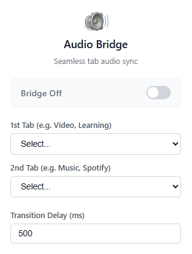

  

# Audio Bridge

Audio Bridge is a lightweight browser extension that synchronizes playback behavior between two selected tabs to keep your focus flow uninterrupted.

Language docs:

- English (this file)
- Turkish: [README.tr.md](README.tr.md)

## Preview (EN)

  

## How It Works

Audio Bridge creates a smart bridge between two tabs (for example, a course video and a music player):

- If **Tab A** becomes audible, **Tab B** is paused.
- If **Tab A** stops (manual pause / no longer audible), **Tab B** is resumed after a configurable delay.
- Internal state handling is used to prevent pause/play loops.

## Architecture Highlights

- **Observer:** Tracks tab audible updates using browser tab events.
- **Controller:** Service worker applies bridge rules and timing.
- **Executor:** Content script sends media play/pause actions to page players.

## Usage

1. Open the extension popup.
2. Pick **Tab A** and **Tab B** from dropdowns.
3. Set transition delay in milliseconds (optional).
4. Turn the bridge **On**.
5. Shortcut: `Ctrl+Shift+Y` (Windows/Linux) or `Cmd+Shift+Y` (macOS).

## Localization

The popup UI supports:

- Turkish (`tr`)
- English (`en`)

If the browser language is neither Turkish nor English, the UI defaults to English.

## Installation

Supports both Google Chrome and Mozilla Firefox (Manifest V3).

- **Chrome:** Navigate to `chrome://extensions/` > Enable **Developer mode** > Click **Load unpacked** > Select the project directory.
- **Firefox:** Navigate to `about:debugging#/runtime/this-firefox` > Click **Load Temporary Add-on...** > Select `manifest.json`.
