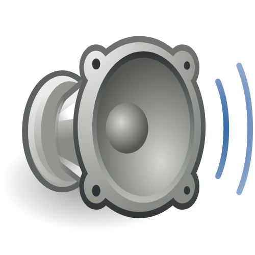

  

# Audio Bridge

Audio Bridge is an open-source browser extension designed to eliminate cognitive load and preserve flow state. It establishes a symmetric, bidirectional synchronization loop between the audio states of two designated tabs. 

When a user works with two primary audio sources—such as an educational video in Tab A and ambient music in Tab B—manually pausing one to play the other is an intrusive context switch. Audio Bridge automates this process.

## Key Features

- **Symmetric Synchronization:** Uses a bidirectional relationship. If Tab A starts producing audio, Tab B is paused. If Tab A is paused manually, Tab B automatically resumes. The inverse is also true.
- **Race Condition Handling:** Employs memory state tracking to distinguish between a user-triggered pause and an extension-triggered pause, effectively preventing infinite play/pause loops.
- **Customizable Transition Delay:** Users can configure a delay (in milliseconds) before the secondary tab resumes, allowing for smoother cognitive transitions.
- **Platform-Specific Injectors:** Alongside standard HTML5 media elements, it supports complex Single Page Applications (SPAs) like the Spotify Web Player via dedicated DOM queries.
- **Cross-Browser Compatibility:** Built on Manifest V3. Functions natively on both Google Chrome and Mozilla Firefox.
- **Global Shortcuts:** Seamlessly toggle the synchronization bridge on and off via keyboard shortcuts (`Ctrl+Shift+Y` or `Cmd+Shift+Y`).

## Technical Architecture

The extension is composed of three primary layers operating within the Manifest V3 framework.

### 1. Service Worker (The Controller)
Residing within `background.js`, the Service Worker acts as the central hub and state machine of the architecture. It utilizes the `chrome.storage.local` API to persist user configurations and the `chrome.tabs` API to observe changes in the `audible` status of tabs.

To prevent infinite feedback loops (where pausing Tab B to play Tab A triggers a new event that pauses Tab A to play Tab B), the controller maintains an `intendedPlayingTabId` reference in memory. This variable tracks the "dominant" tab—the one the user or the system intentionally initiated. If a tab stops producing audio, the Controller checks if it matches the `intendedPlayingTabId`; if so, it safely passes the execution context to the secondary tab.

### 2. The Observer
The observation logic relies on `chrome.tabs.onUpdated`. By listening specifically for changes to the `audible` parameter, the extension minimizes overhead and footprint. It does not actively poll the DOM for media states; instead, it responds passively and asynchronously to audio hardware state changes dispatched by the browser engine.

### 3. Content Scripts (The Executor)
The `content.js` script handles DOM manipulation inside the target tab environments. It listens for `PAUSE_MEDIA` and `PLAY_MEDIA` commands from the Service Worker. 

It executes two types of queries to control media flow:
- **Generic HTML5 Media Interface:** Scans the DOM for `<video>` and `<audio>` tags. When pausing, it marks the modified elements with a custom data attribute (`dataset.bridgePaused = 'true'`). This granular state tracking allows the `PLAY_MEDIA` command to only resume media that the extension explicitly halted, preventing the accidental playback of unrelated or background media elements on the same page.
- **Custom Application Overrides:** For platforms like Spotify that utilize custom media buffer systems instead of exposed HTMLMediaElements, the script targets specific localized ARIA labels and test identifiers (e.g., `[data-testid="control-button-playpause"]`) to simulate user interactions directly on the interface.

## Installation and Testing

### Google Chrome
1. Navigate to `chrome://extensions/` in your browser.
2. Enable **Developer mode** in the top right corner.
3. Click on **Load unpacked** in the top left corner.
4. Select the directory containing the project files.

### Mozilla Firefox
1. Navigate to `about:debugging#/runtime/this-firefox`.
2. Click on **Load Temporary Add-on...**.
3. Select the `manifest.json` file located in the project directory.

## Usage

1. Open two tabs containing media (e.g., a YouTube lecture and a Spotify playlist).
2. Click the Audio Bridge extension icon to open the popup interface.
3. Select the two tabs you wish to synchronize from the respective dropdown menus.
4. Toggle the main switch to activate the bridge.
5. Play or pause media in either tracked tab to observe the automatic synchronization.
