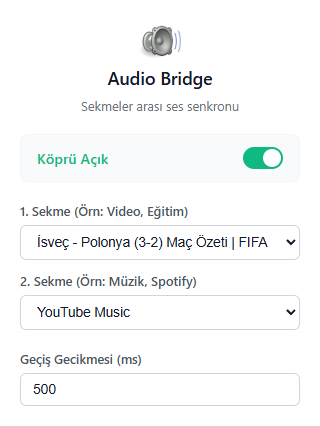

  

# Audio Bridge

Audio Bridge, iki seçili sekme arasındaki oynatma davranışını senkronize ederek odak akışını korumaya yardımcı olan hafif bir tarayıcı eklentisidir.

Dil dokümanları:

- İngilizce (ana): [README.md](README.md)
- Türkçe (bu dosya)

## Önizleme (TR)

  

## Nasıl Çalışır

Audio Bridge iki sekme arasında akıllı bir köprü kurar (örneğin bir eğitim videosu ve bir müzik sekmesi):

- **Sekme A** sesli olduğunda, **Sekme B** duraklatılır.
- **Sekme A** sustuğunda (manuel durdurma / ses kesilmesi), **Sekme B** ayarlanan gecikme sonrası tekrar oynatılır.
- Döngüye girmemek için arka planda durum takibi yapılır.

## Mimari Özeti

- **Observer:** Tarayıcı sekme olaylarından ses durumu değişimlerini dinler.
- **Controller:** Service worker, köprü kurallarını ve gecikme yönetimini uygular.
- **Executor:** Content script, sayfadaki medya oynatıcılara play/pause komutları gönderir.

## Kullanım

1. Eklenti popup penceresini aç.
2. Açılır listelerden **Sekme A** ve **Sekme B** seç.
3. Gerekirse gecikme süresi (ms) belirle.
4. Köprüyü **Açık** konumuna getir.
5. Kısayol: `Ctrl+Shift+Y` (Windows/Linux) veya `Cmd+Shift+Y` (macOS).

## Dil Desteği

Popup arayüzü şu dilleri destekler:

- Türkçe (`tr`)
- İngilizce (`en`)

Tarayıcı dili bunlardan biri değilse varsayılan olarak İngilizce kullanılır.

## Kurulum

Manifest V3 ile hem Google Chrome hem Mozilla Firefox desteklenir.

- **Chrome:** `chrome://extensions/` -> **Developer mode** aç -> **Load unpacked** -> proje klasörünü seç.
- **Firefox:** `about:debugging#/runtime/this-firefox` -> **Load Temporary Add-on...** -> `manifest.json` seç.
